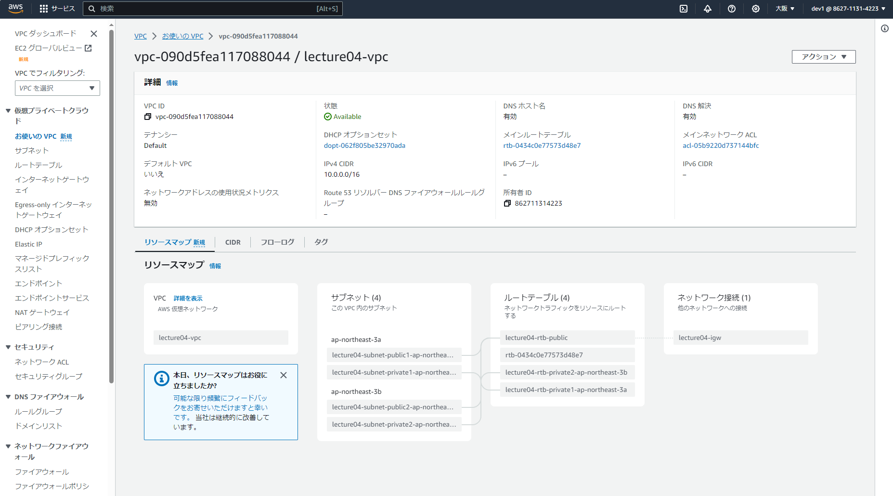
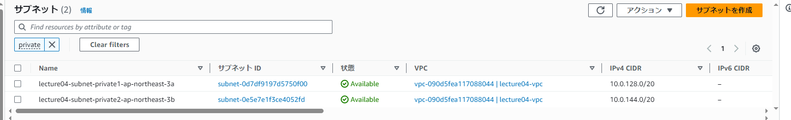
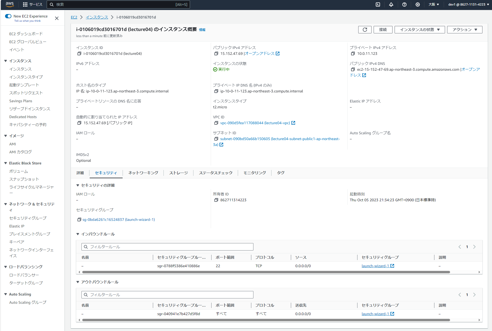
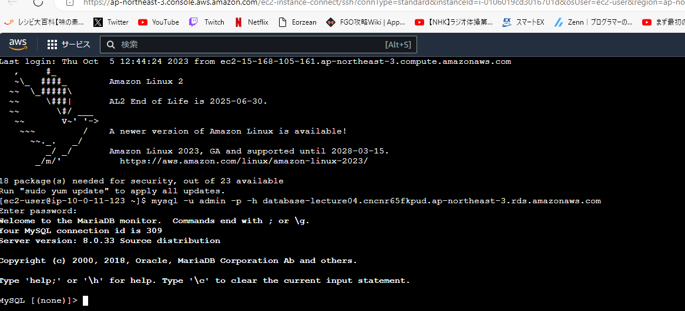

## VPC構成確認

## サブネットの確認

## RDSの構成確認

## セキュリティグループの確認

## RDS疎通確認

## 学んだこと
- VPC・サブネットとインスタンスとRDSの関係・構成について、構成図で説明してもらうとイメージしやすく理解できたような気がした。
- AWSならEC２インスタンスコネクトからターミナルに入ることができる。

## 所感
インスタンス構成の際に様々な設定項目があったが、なんとなく で出来てしまったため
今週は各項目の設定内容にどのような違いがあるのか調べたい。
